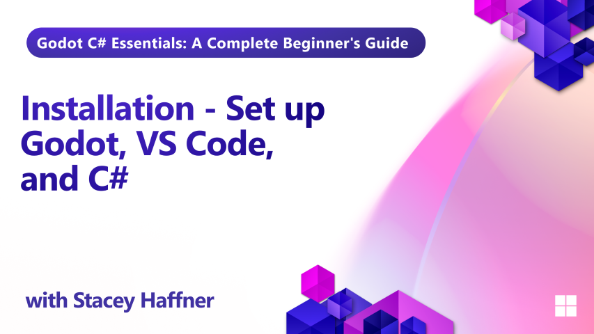

Before you start building games in Godot with C#, it's essential to get your development environment properly configured. In this episode, you'll walk through every step needed to install and set up Godot with .NET support, configure Visual Studio Code, and download the course project from GitHub. 

## What you'll learn

- How to install Godot with .NET support
- Setting up Visual Studio Code as your editor
- Installing the .NET SDK and C# Dev Kit
- Configuring Godot to work with VS Code
- Creating launch and task files for debugging
- Installing the C# Tools for Godot extension
- Downloading the course files from GitHub

## Requirements

No prior setup is required for this lesson.

## Project Files

- The [VS Code - Task and Launch Snippets](./code-snippet.md) has the code blocks needed for the Visual Studio Code Task & Launch step.

