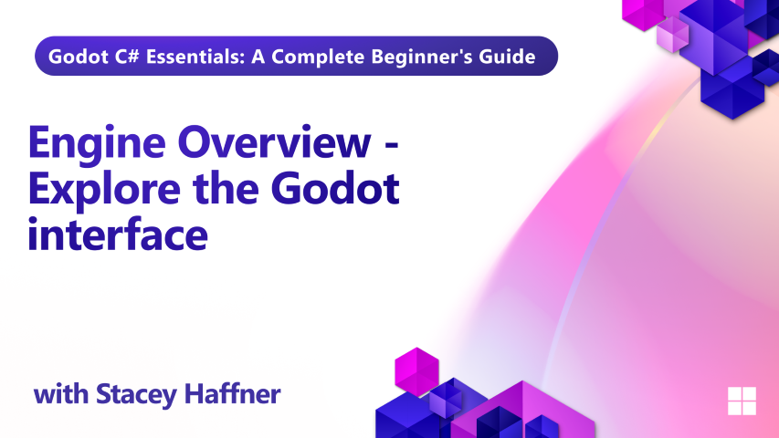

In Episode 3 of our Godot C# training series, we take a guided tour through the Godot engine and editor to help you get comfortable with the tools you'll use throughout your game development journey.

You'll learn how to create and manage projects using the Godot Project Manager, explore the editor interface, and understand the purpose of key panels like the Scene panel, File System, Inspector, and more. This foundational knowledge will help you navigate Godot with confidence as you begin building your own games.

## What you'll learn

- Creating and managing projects in the Project Manager
- Navigating the Godot editor interface
- Understanding key panels: Scene, File System, Inspector, and more
- Exploring different editor views: 2D, 3D, Script, Game, Asset Library

## Requirements

You should already have Godot with .NET support and Visual Studio Code installed. See the [installation lesson](../01-installation/README.md) if you need to set up your development environment.

## Project Files

No project files are provided for this lesson.
