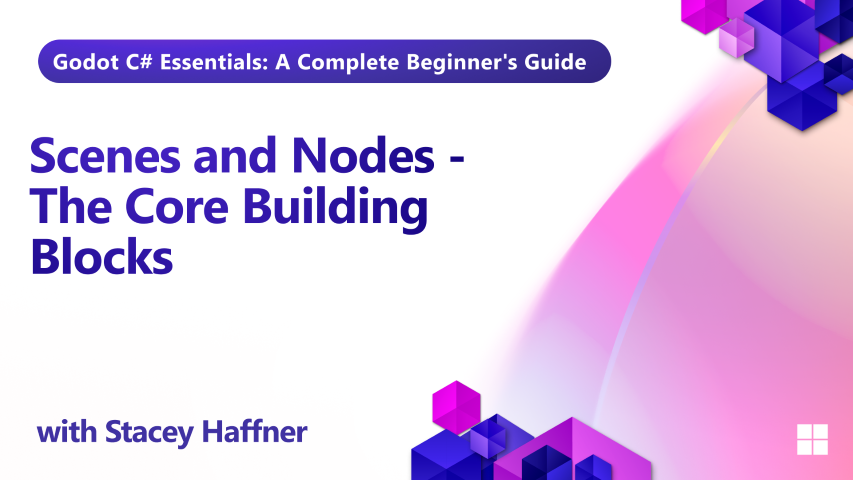

In Episode 4 of our Godot C# training series, we dive into the foundational building blocks of game development in Godot: scenes and nodes. You'll learn how to create your first level scene, add a ground plane with collision, and build a reusable player character complete with a third-person camera setup.

This hands-on walkthrough covers everything from node hierarchy and mesh setup to lighting and reusable scene instancing. By the end of this lesson, you'll have a playable scene with a controllable character and a camera that follows the action.

## What you'll learn

- How scenes and nodes work together in Godot
- Creating a level scene with ground and collision
- Building a reusable player character using CharacterBody3D
- Setting up a third-person camera with SpringArm3D
- Adding directional lighting to your scene
- Using reusable scenes for efficient game design

## Requirements

You should already have Godot with .NET support and Visual Studio Code installed. See the [installation lesson](../01-installation/README.md) if you need to set up your development environment.

## Project Files

Only the final project files are provided for this lesson.
