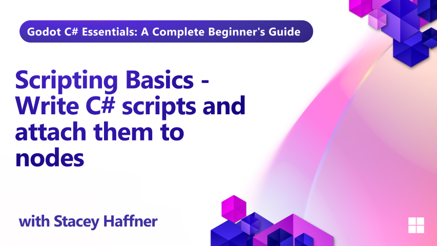

In Episode 5 of our Godot C# training series, we bring your player character to life with code! This lesson introduces the fundamentals of scripting in Godot using C#, including how to handle input, apply movement, and rotate the player smoothly using physics-based logic.

You'll learn how to use Godot’s built-in lifecycle and input methods, configure the Input Map for flexible controls, and write clean, reusable code to drive gameplay. By the end of this episode, your player will be fully controllable and responsive to keyboard input — and ready to interact with the world.

## What you'll learn

- How to configure the Input Map for keyboard controls
- Using lifecycle methods like _Ready, _Process, and _PhysicsProcess
- Handling input with _UnhandledInput and _UnhandledKeyInput
- Writing movement logic using CharacterBody3D
- Applying smooth rotation with LerpAngle
- Organizing script variables with Export and ExportGroup
- Debugging common issues in Godot C# scripts

## Requirements

This tutorial assumes basic familiarity with C# programming concepts including classes, methods, variables, and object-oriented principles.

## Project Files

Both starter and final project files are available for this lesson.

