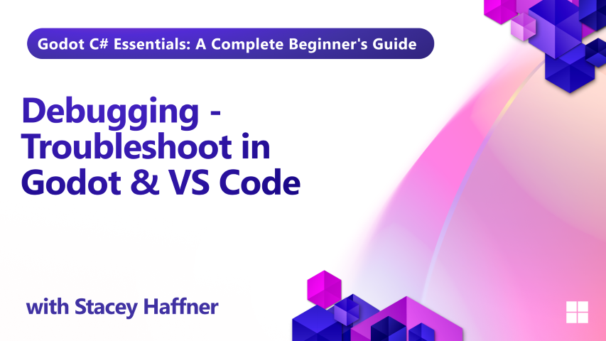

In Episode 6 of our Godot C# training series, we shift from building gameplay to diagnosing and fixing issues. Debugging is a critical skill in game development, and this episode walks you through the tools Godot and Visual Studio Code offer to help you track down bugs and understand what’s happening under the hood.

You'll learn how to use Godot’s built-in debugger, visualize collision shapes, inspect live scene data, and leverage Visual Studio Code’s powerful debugging features — including conditional breakpoints, watch expressions, and the call stack. Whether you're troubleshooting physics, input, or timing issues, this lesson gives you the confidence to debug like a pro.

## What you'll learn

- How to inspect live scene data using Godot’s Remote tab
- Using print, warnings, and errors to debug in Godot
- Visualizing collision shapes and physics bodies
- Setting and using breakpoints in Visual Studio Code
- Exploring watch expressions, call stack, and debug console
- Creating and using conditional breakpoints for cleaner debugging

## Requirements

This tutorial assumes basic familiarity with C# programming concepts including classes, methods, variables, and object-oriented principles. 

## Project Files

Both starter and final project files are available for this lesson.
