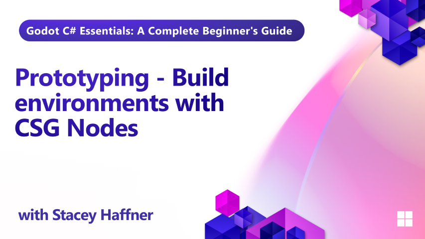

In Episode 7 of our Godot C# training series, we explore how to quickly prototype game environments using Constructive Solid Geometry (CSG) nodes. Prototyping is a vital step in game development — it helps you test ideas, layout scenes, and iterate fast without worrying about polish.

You'll learn how to block out a room using CSG primitives, apply collision settings, and use operations like subtraction to create doors and openings. We also cover how to combine multiple shapes using the CSG Combiner node for efficient scene management. This episode is all about speed, flexibility, and testing your layout before committing to final assets.

## What you'll learn

- How to use CSG nodes to build 3D environments
- Setting up snapping and transform tools for precision
- Applying collision detection to CSG shapes
- Using CSG operations: union, intersection, subtraction
- Creating reusable geometry with CSG Combiner
- Best practices for prototyping layout and flow

## Requirements

This tutorial assumes basic familiarity with C# programming concepts including classes, methods, variables, and object-oriented principles. It also assumes basic understanding of Godot. 

## Project Files

Both starter and final project files are available for this lesson.

