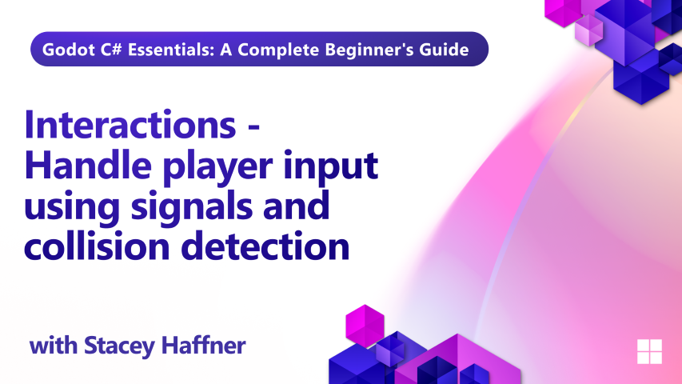

In Episode 8 of our Godot C# training series, we explore how to make your game world feel alive through player interactions. Using Godot’s signal system and Area3D nodes, you’ll learn how to detect when a player enters a space, trigger events like collecting items, and communicate between game systems like inventory and UI.

This hands-on episode walks through building a “Chicken Station” that responds to player input, emits custom signals, and updates other parts of the game. You’ll also learn how to set up collision layers and masks, connect signals in C#, and prepare your game for crafting mechanics in the next lesson.

## What you'll learn

- How to use Area3D nodes to detect player proximity
- Setting up collision shapes and layers/masks for interaction
- Connecting built-in signals like body_entered and body_exited
- Creating and emitting custom signals in C#
- Communicating between game systems using signal events
- Preparing interactive objects for crafting systems

## Requirements

This tutorial assumes basic familiarity with C# programming concepts including classes, methods, variables, and object-oriented principles. It also assumes basic understanding of Godot. 

## Project Files

Both starter and final project files are available for this lesson.

