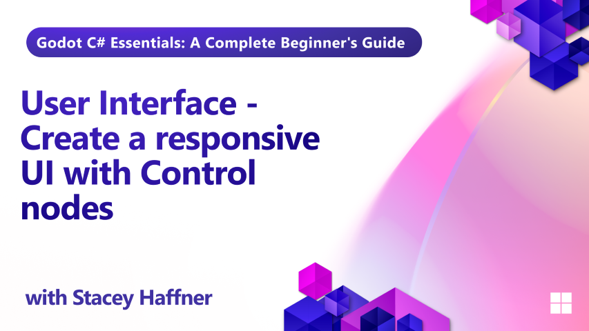

In Episode 9 — the final chapter of our Godot C# training series — we bring everything together by building a responsive user interface that connects directly to gameplay. Learn how to create dynamic UI layouts using reusable scenes, control nodes, and signal-driven interactions.

This episode walks through the creation of a crafting interface where players can combine ingredients like milk and chicken to make a recipe. You'll learn how to instantiate UI components in code, wire up buttons with custom visuals, and respond to player actions with clean, scalable architecture.

## What you'll learn

By the end of this lesson, you will:

- How to build responsive UI layouts using control nodes
- Creating reusable UI components with containers and anchors
- Styling buttons with sprite atlases for hover and click states
- Connecting UI to gameplay using signals and dynamic data
- Instantiating UI elements in code and populating them with game state
- Best practices for clean, scalable UI design in Godot

## Requirements

This tutorial assumes basic familiarity with C# programming concepts including classes, methods, variables, and object-oriented principles. It also assumes basic understanding of Godot. 

## Project Files

Both starter and final project files are available for this lesson.

