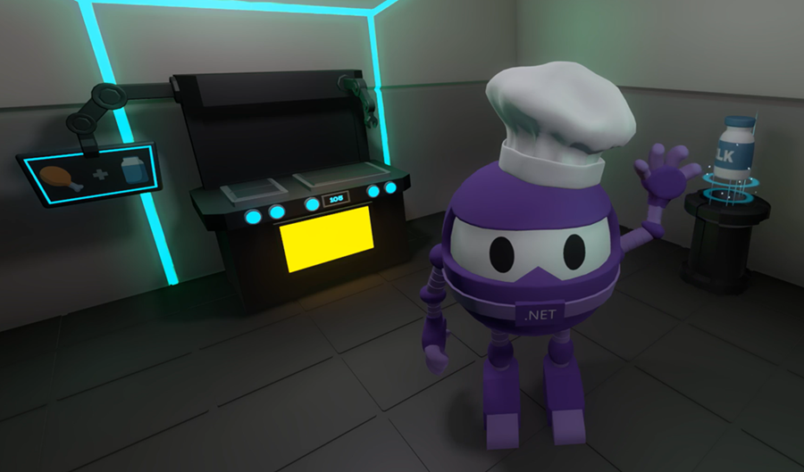

# Godot C# Essentials: A Beginner's Guide

Welcome to your first step into game development with [Godot](https://godotengine.org/) and [C#](https://learn.microsoft.com/en-us/dotnet/csharp/)! This [beginner-friendly course](https://www.youtube.com/playlist?list=PLdo4fOcmZ0oU76HcRU9jdPnOP9eFUglle) helps C# developers learn game development with the Godot Engine, walking you step by step through how to use C# to build interactive games. By the end, you understand the core concepts and workflows needed to bring your ideas to life.

You'll learn how to create a controllable player, build levels with scenes and nodes, add interactive objects, and even design a simple crafting UI. With hands-on challenges and a final sample project, you'll gain the confidence to start building your own games.

## Videos

| Lesson               | Video Link       | Project Files       |
|-----------------------|------------------|---------------------|
| Introduction to Godot C# Essentials: A Complete Beginner's Guide | [Video](https://youtu.be/f0-ucs37ASQ) | [Link](./01-installation/README.md)   |
| Installation - Set up Godot, VS Code, and C# | [Video](https://youtu.be/MmuiwY_tiEo) | [Link](./01-installation/README.md)   |
| Engine Overview - Explore the Godot interface | [Video](https://youtu.be/RdciTS7sRhw) | [Link](./02-engine-overview/README.md)  |
| Scenes and Nodes - The Core Building Blocks | [Video](https://youtu.be/o4uqehEAu3M) | [Link](./03-nodes-and-scenes/README.md)  |
| Scripting Basics - Write C# scripts and attach them to nodes | [Video](https://youtu.be/iEMbetxAwvA) | [Link](./04-scripting/README.md)      |
| Debugging - Troubleshoot in Godot & VS Code | [Video](https://youtu.be/eQzfXKf1YfY) | [Link](./05-debugging/README.md)      |
| Prototyping - Build environments with CSG Nodes | [Video](https://youtu.be/53B49XIcZk4) | [Link](./06-prototyping/README.md)    |
| Interactions - Handle player input using signals and collision detection | [Video](https://youtu.be/E9WACDWjWzI) | [Link](./07-interactions/README.md)   |
| User Interface - Create a responsive UI with Control nodes | [Video](https://youtu.be/Vav3Ml4z6-8) | [Link](./08-user-interface/README.md) |

## Project Files

Some lessons may include project files, in which case you will find the following:

- **Starting Project**: A pre-configured project to help you get started quickly with the lesson.
- **Final Project**: A completed version of the project showing the end result of the lesson.

## Final Example Project: Fly By Café

Explore the **[Fly By Café sample project](./final-example-project/README.md)** to see how everything comes together. This project demonstrates the techniques that you learned a step further. Concepts include:

**Advanced Character Systems**
- Animation management using AnimationTree with state machines and layered animations.
- Jump mechanics with gravity and ground detection for platforming-style movement.

**Flexible Game Architecture**
- Singleton pattern for global access to player and UI systems.
- Custom Resource system for data-driven design.
- Interface-based interaction framework that makes adding new interactive objects simple.

**Gameplay Systems**
- Inventory system with automatic item stacking and quantity management.
- Crafting system that validates recipes and transforms ingredients into finished products.
- World-space UI using SubViewport to display interactive prompts in 3D space.

**Environment Polish**
- Animated doors using AnimationPlayer for responsive environmental interactions.
- Simple particle system to add visual flair and feedback.
- Simple animation created directly in Godot to show 360 rotation on a loop.

## Contributing
This project welcomes contributions and suggestions. Most contributions require you to agree to a Contributor License Agreement (CLA) declaring that you have the right to, and actually do, grant us the rights to use your contribution. For details, visit https://cla.opensource.microsoft.com.

When you submit a pull request, a CLA bot will automatically determine whether you need to provide a CLA and decorate the PR appropriately (e.g., status check, comment). Simply follow the instructions provided by the bot. You will only need to do this once across all repos using our CLA.

This project has adopted the Microsoft Open Source Code of Conduct. For more information see the Code of Conduct FAQ or contact opencode@microsoft.com with any additional questions or comments.

## Trademarks
This project may contain trademarks or logos for projects, products, or services. Authorized use of Microsoft trademarks or logos is subject to and must follow Microsoft's Trademark & Brand Guidelines. Use of Microsoft trademarks or logos in modified versions of this project must not cause confusion or imply Microsoft sponsorship. Any use of third-party trademarks or logos is subject to those third-parties' policies.
